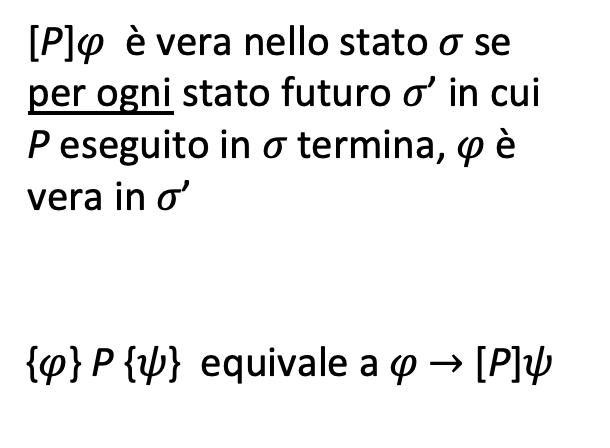
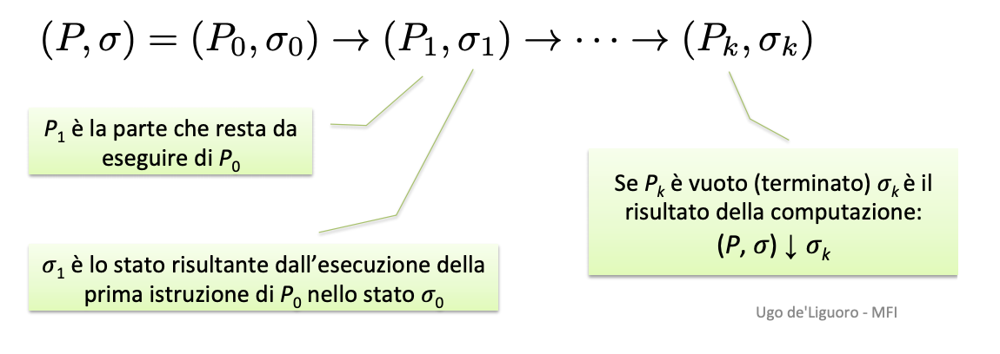
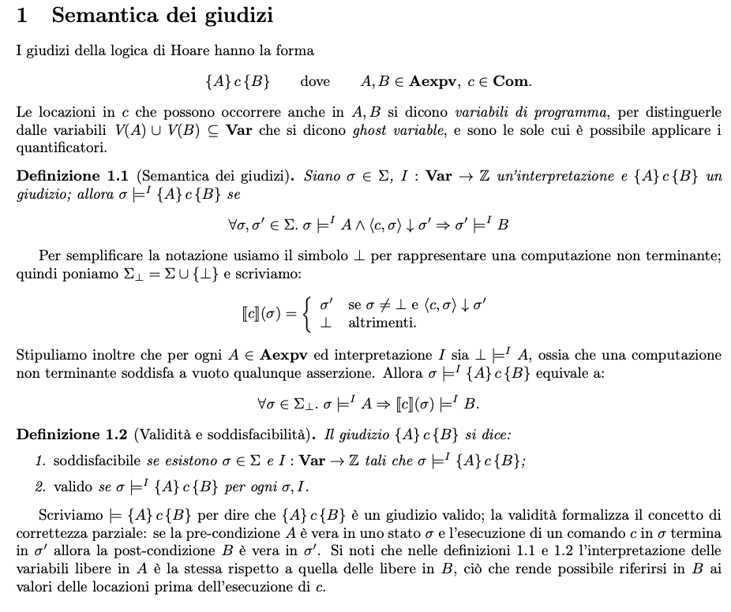
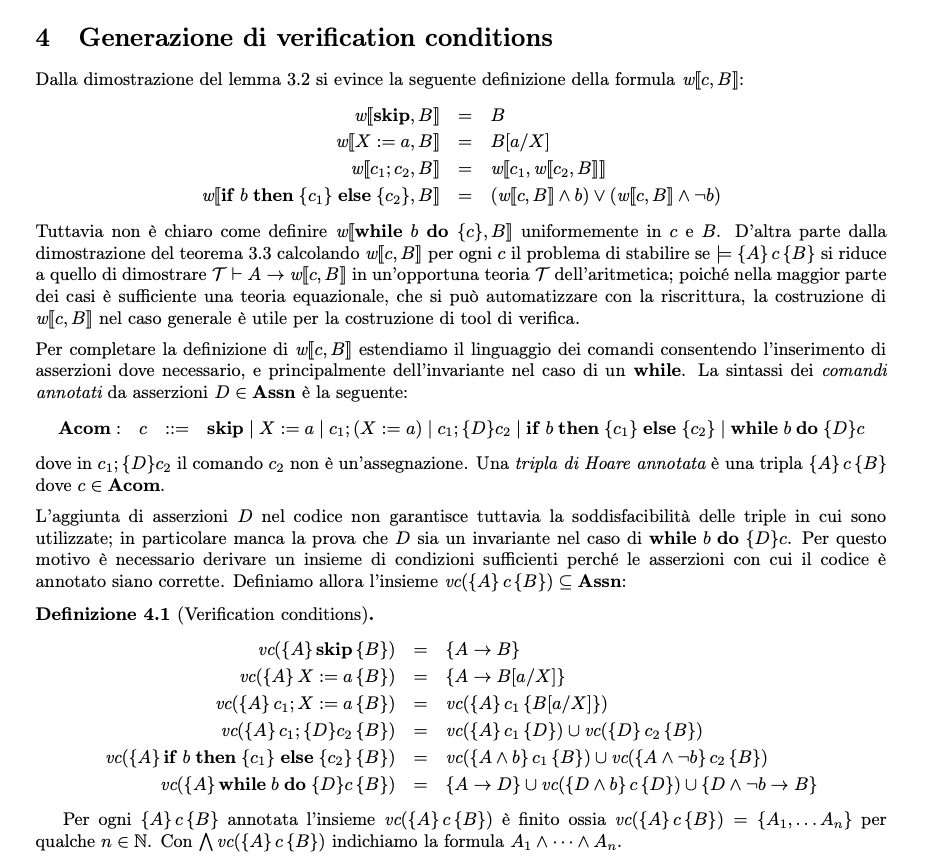
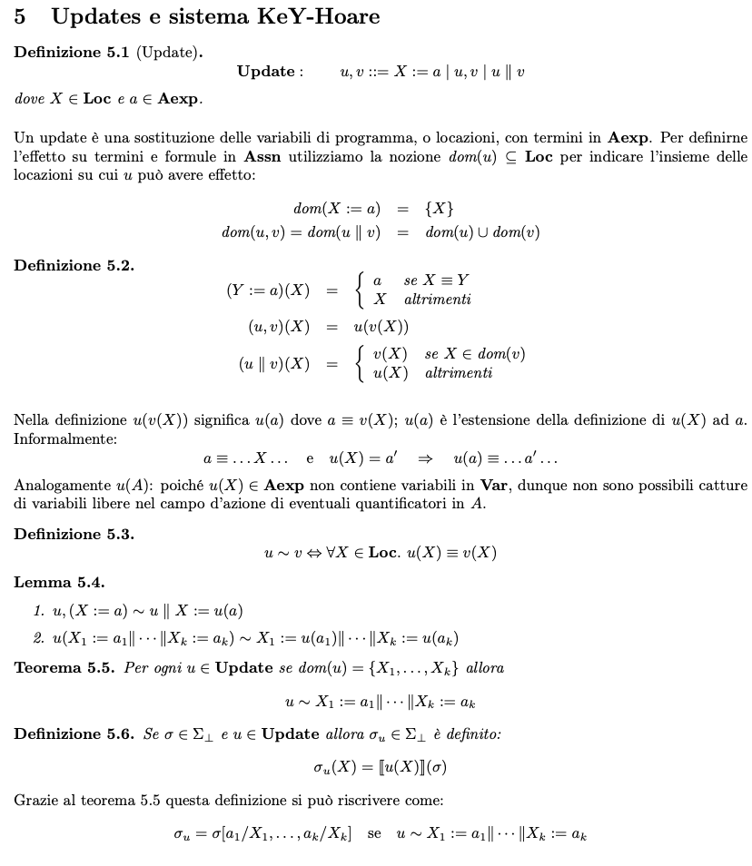
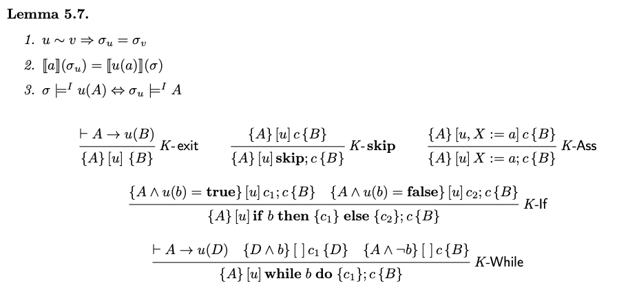

# Intro

## Verifica Model-based

Modello M (automa) e formula φ

M	⊨ φ  => M soddisfa φ

Bisogna controllare tutti gli stati di M

## Verifica proof-based o deduttiva

Nella verifica proof-based o deduttiva non si considerano tutti
gli	(infiniti) stati che il sistema/programma	può	attraversare,
ma si cerca	di dimostrare che la relazione input-output R del
programma, descritta dalla formula φR, è deducibile in un
calcolo logico da un insieme (finito) di ipotesi Γ

Γ ⊢ φR  :=  φR è deducibile da Γ

## Logica semantica

## Cheatsheet dei simboli

Il tipo di un simbolo e' l'insieme di appartenenza.

Se il simbolo corrisponde a un insieme allora il tipo e' il soprainsieme, scritto {I}.

Simbolo | Tipo | Definizione
--|---|--
n͟  | Num  |  Numerale
X,Y,...  |  Loc | Variabile di programma
a  | Aexp  | Espressione aritmetica
b  | Bexp | Espressione booleana
c  | Com | Comando: Σ -> Σ
σ  | Σ  | Stato: Loc -> Num
σ[n͟/X]  | Σ  | Stato dopo l'assegnazione di n͟ a X
x,y,...  | Var  | Variabile logica |
a  | Aexpv  | Termine: espressione aritmetica con variabili logiche
b  | Assn | Asserzione: espressione booleana con variabili logiche e quantificatori
σ˜ | | Loc -> Z, per mappare la variabile al valore numerico
I  |   | Interpretazione delle variabili logiche: Var -> Z
[[a]]σI | Z | Valore dell'espressione secondo quello stato e interpretazione
I[n/x]  |   | Interpretazione I con x = n
V(a) | {Var} |  Insieme delle variabili logiche in a
V(A) | {Var} |  Insieme delle variabili logiche in A
FV(A) | {Var} |  Insieme delle variabili logiche libere in A
BV(A) | {Var} |  Insieme delle variabili logiche vincolate in A
⊥  | Σ⊥ | Stato non terminante
AI  | {Σ⊥} | Stati in cui A e' valida
[[c]]AI  | {Σ⊥} | Stati risultanti dall'esecuzione di c sugli stati AI (ammesso che {A} c {B} sia valida)
wlpI[[c,B]]  | {Σ⊥}  | Weakest liberal precondition: stati nei quali se si eseguisse c B sarebbe valida
w[[c,B]]  | Assn  | Formula di precondizione che vale in tutti gli stati wlpI[[c,B]] per una certa I. Se esiste per ogni c ∈ Com, B ∈ L allora il linguaggio e' *espressivo* rispetto a L
vc({A}c{B})  | {Assn}  | Condizioni sufficienti per rendere corrette le asserzioni della tripla
c  | Acom | Comando che permette l'inclusione di invariante di ciclo e asserzione tra due comandi

# Semantica operazionale

`sym(a) := numero di simboli diversi da costante di a (quindi operatori e variabili)`

# Logica del prim'ordine e sequenti

`Variabili (Var) vincolate se in quantificatori, libere altrimenti.`

## Regole dei sequenti

# Logica di Hoare

## Regole

## Definizioni

## Regole con update

